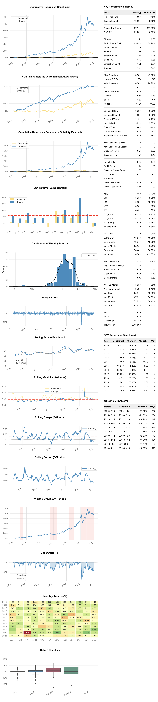

# Quantitative Financial Modeling

## About this project

Factor investing is "an investment approach that involves targeting specific drivers of return across asset classes" ([BlackRock](https://www.blackrock.com/us/individual/investment-ideas/what-is-factor-investing)).

This project uses style factors — such as value, minimum volatility, momentum, quality and size — to craft data-driven investment strategies and run backtests to estimate their performances.

## Market data

The scope of the project is the analysis of stocks and depositary receipts which are publicly traded in the Brazilian stock market. Additionally, assets were filtered by marketability. 

The IBrX 100 is a Brazilian stock market index that tracks the performance of the 100 most marketable listed companies. All assets analyzed were part of the 100 top stocks ranked by marketability on the date of purchase — which aimed to emulate the IBrX 100 components, although the index gets rebalanced every quarter, and not daily.

## Application and results

The implemented strategy combined factors **momentum** and **minimum volatility** with an intersectional model.

It was tested from March 1st, 2010 to December 30th, 2021.

